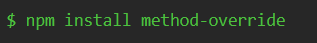
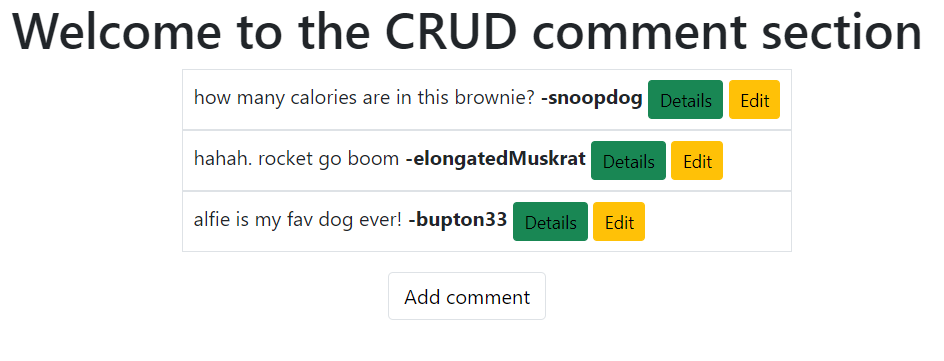

# CRUD-commenting-element-First-attempt-
This is my first attempt at building out a full CRUD application. This project is the next step-up from my previous repo (https://github.com/WillUK99/Express-EJS-subreddit-mockup) and allowed me to practice my backend skills and develop them further.

## Technologies.
-HTML -JS -Node.JS -Express -EJS -Bootstrap -CSS.

### About.
This is my first attempt at creating a fully functioning CRUD application. Utilising Express it was fairly straight forward implementing my RESTful routes, the only issue I ran into during the routing stage was patching through the edit.ejs payload. To get around this I installed method-override to trick html into doing what I needed it too... 
 
 

 
The comments which are shown on the 'home page' are all hardcoded in as im still in the process learning about databases and how to implement them. To give these comments unique ID's I installed uuid which is a middleware which auto generates a unique ID tag. All comments are given a unique ID and can be viewed when the detailed button is pressed - The delete button can also be found in the details section (as seen below).
 
 

 
My focus for this project was not the UX/UI designing aspect it was purely a learning process, that being said I did install bootstrap and link it to all pages on the application as default html styling is blinding.
 
 

 
#### Thank you for reading.
